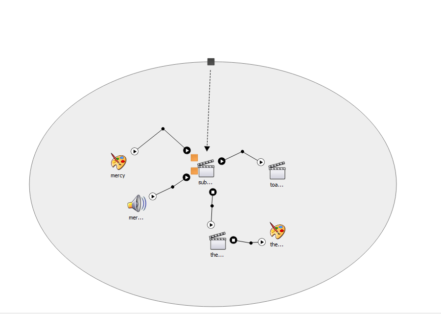
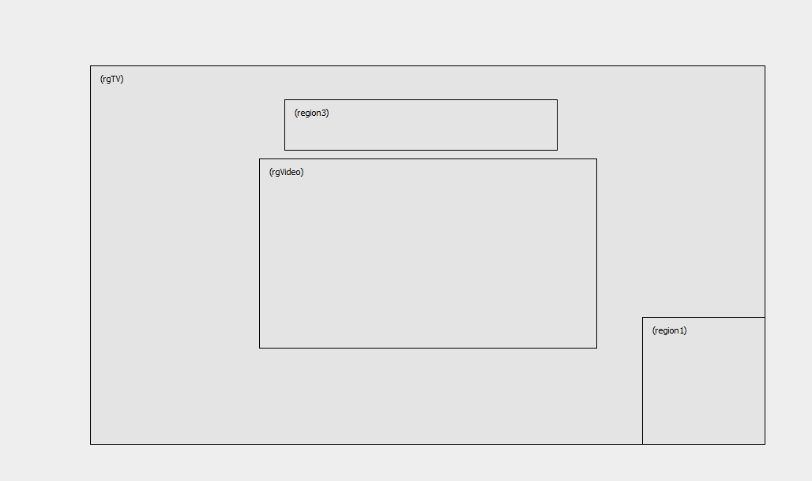

# Ginga-NCL

O Ginga-NCL é um conjunto de normas brasileiras que define o middleware para a televisão digital interativa no país, permitindo a criação de aplicações interativas para televisões digitais.

## NCL (Nested Context Language)

A Linguagem de Composição NCL é uma linguagem de marcação baseada em XML, desenvolvida especificamente para criar aplicações interativas para televisões digitais. Com NCL, é possível definir a estrutura e o comportamento dos elementos de uma aplicação, como vídeos, imagens, texto e eventos interativos.

## Aplicação usando Regiões, Mídia, Portas, Binds, Vídeos e Imagens

Ao desenvolver uma aplicação com Ginga-NCL, você pode aproveitar diversos recursos para criar experiências interativas para televisão digital. Aqui estão alguns desses recursos:

### Regiões

As regiões permitem definir áreas específicas da tela onde os elementos da sua aplicação serão exibidos. Você pode dividir a tela em diferentes regiões e controlar a posição e o tamanho dos elementos dentro delas. Isso oferece flexibilidade para a disposição visual dos conteúdos.

### Mídia

Você pode incorporar vídeos e imagens à sua aplicação usando elementos de mídia. O Ginga-NCL suporta formatos populares de mídia, como MP4, AVI, JPEG e PNG. Com isso, você pode criar interfaces ricas e envolventes, combinando elementos visuais e de áudio.

### Portas

As portas são elementos utilizados para definir a comunicação entre os componentes da aplicação. Com as portas, é possível enviar e receber informações, permitindo a interação entre diferentes partes da aplicação.

### Binds

Os binds são usados para associar elementos da aplicação a eventos específicos. Eles permitem que você defina ações a serem executadas quando determinados eventos ocorrerem, como clique em um botão ou pressionamento de uma tecla.

### Vídeos e Imagens

O Ginga-NCL permite a exibição de vídeos e imagens em sua aplicação. Você pode usar vídeos para reproduzir clipes, filmes ou animações, enquanto as imagens podem ser usadas para exibir gráficos, fotos ou ilustrações.

Em resumo, o Ginga-NCL é um conjunto de normas e tecnologias para a criação de aplicações interativas na televisão digital. Com recursos como regiões, mídia, portas, binds, vídeos e imagens, você pode desenvolver experiências interativas e envolventes para os telespectadores.

## Resumo do projeto

Possui um vídeo como entrada e partir de um determinado momento do vídeo certos elementos são exibidos na tela. O vídeo é exibido na região central e os elementos são exibidos em regiões específicas da tela. Os elementos são exibidos em sequência e cada elemento é exibido por um determinado tempo.

## Estrutura do Projeto

A seguir, apresentamos algumas imagens que ilustram a estrutura do seu projeto:

1. **Layout da NCL:**
   

     
   

2. **Exemplo de Composição de Regiões:**
   

     
   

Sinta-se à vontade para compartilhar as imagens e o gif do seu projeto para uma melhor compreensão e visualização da sua aplicação.
